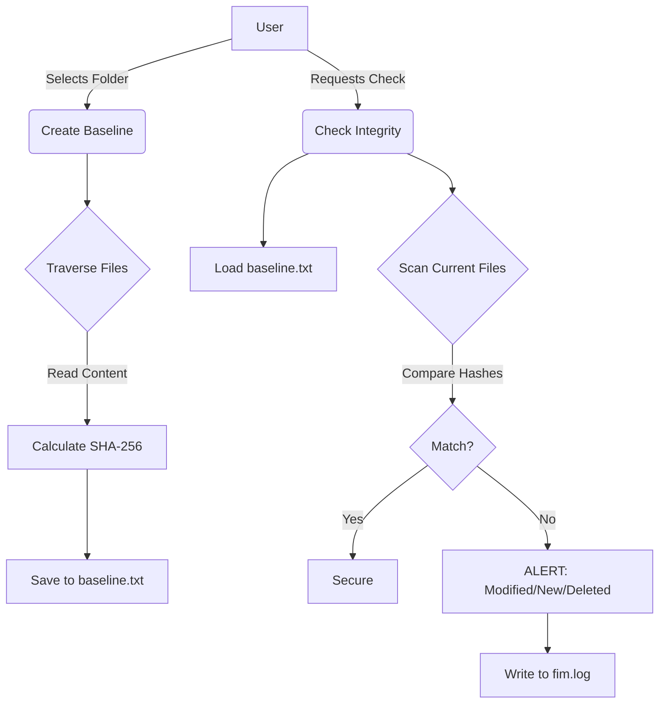

# Project Report: File Integrity Monitor (FIM)

## 1. Abstract

In the domain of Information Security, maintaining the integrity of data is paramount. Unauthorized modifications, deletions, or the addition of malicious files can compromise entire systems. This project, the **File Integrity Monitor (FIM)**, is a security tool designed to detect such anomalies in real-time. Built using Python, the system employs cryptographic hashing (SHA-256) to create a "fingerprint" or baseline of a file system's state. By comparing the current state of files against this trusted baseline, the FIM can instantly identify discrepancies. The tool supports monitoring multiple directories, detects new file injections, and provides a detailed audit log of all integrity checks. This report details the development, architecture, and performance of the FIM, demonstrating its effectiveness as a lightweight security solution.

## 2. Introduction

### 2.1 Background
With the increasing sophistication of cyber threats, traditional antivirus software is often insufficient to detect all forms of intrusion. Attackers frequently modify system files, inject backdoors, or alter configuration files to maintain persistence or steal data. "Integrity" is one of the three pillars of the CIA Triad (Confidentiality, Integrity, Availability), yet it is often the hardest to guarantee.

### 2.2 What is a File Integrity Monitor?
A File Integrity Monitor (FIM) is a technology that validates the integrity of operating system and application software files using a verification method between the current file state and a known, good baseline. It acts as a digital surveillance camera for the file system.

### 2.3 Motivation
The motivation behind this project was to understand the core mechanisms of intrusion detection systems (IDS). By building a FIM from scratch, we aim to demonstrate how cryptographic primitives like SHA-256 can be applied practically to secure a file system against unauthorized tampering.

## 3. Problem Statement

In modern computing environments, files are constantly changing. However, distinguishing between legitimate changes (updates, user edits) and malicious changes (malware infection, ransomware encryption, unauthorized access) is a significant challenge.

**Key problems addressed:**
1.  **Silent Failures**: Files can be corrupted or modified without any immediate visible symptoms.
2.  **Unauthorized Access**: An attacker might modify a sensitive document or script without triggering standard firewalls.
3.  **Malware Injection**: Viruses often drop new files into system directories to execute malicious code.
4.  **Manual Monitoring Impossibility**: It is humanly impossible to manually check thousands of files for byte-level changes every day.

## 4. Objectives

The primary objective of this project is to develop a robust, automated tool that ensures file system integrity.

**Specific Objectives:**
*   **Develop a Baseline Mechanism**: To create a secure snapshot of the file system state using SHA-256 hashing.
*   **Implement Detection Logic**: To accurately identify three types of changes:
    1.  **Modifications**: Content changes in existing files.
    2.  **Deletions**: Removal of monitored files.
    3.  **Additions**: Creation of new, unauthorized files in monitored directories.
*   **Ensure Scalability**: To allow the monitoring of multiple, distinct directories simultaneously.
*   **User Experience**: To provide a hybrid interface (CLI for automation and Interactive Menu for ease of use).
*   **Auditability**: To maintain a persistent log (`fim.log`) of all security events for forensic analysis.

## 5. Technology Stack

The project was built using the **Python** programming language due to its powerful standard libraries and readability.

*   **Language**: Python 3.x
*   **Core Libraries**:
    *   `hashlib`: Used for generating SHA-256 hashes. SHA-256 was chosen over MD5 or SHA-1 due to its collision resistance and higher security standard.
    *   `os` & `sys`: Used for file system traversal (walking directories) and system-level operations.
    *   `argparse`: Used to parse command-line arguments, enabling the tool to be integrated into scripts.
*   **Development Environment**: VS Code.

## 6. System Architecture

The system operates in two main phases: **Initialization (Baseline Creation)** and **Monitoring (Integrity Check)**.

### 6.1 Phase 1: Baseline Creation
1.  **Input**: The user selects one or more directories to monitor.
2.  **Traversal**: The system recursively walks through every file in the selected directories.
3.  **Hashing**: For each file, the system calculates a SHA-256 hash. This hash is a unique 256-bit signature of the file's content.
4.  **Storage**: The path and hash of every file are stored in a database file (`baseline.txt`).
    *   *Format*: `File_Path|Hash_Value`

### 6.2 Phase 2: Integrity Checking
1.  **Loading**: The system reads the `baseline.txt` to load the "trusted state".
2.  **Re-Scanning**: It scans the monitored directories again.
3.  **Comparison Logic**:
    *   **If Hash Changed**: The file has been **MODIFIED**.
    *   **If File Missing**: The file has been **DELETED**.
    *   **If New File Found**: The file is **ADDED** (New).
4.  **Alerting**: The system prints alerts to the console and logs the event to `fim.log`.

### 6.3 Data Flow Diagram

## 7. Result and Analysis

The FIM was tested in various scenarios to validate its accuracy.

### 7.1 Test Case 1: File Modification
*   **Action**: A text file `secret.txt` was modified by changing a single character.
*   **Result**: The system detected the hash mismatch immediately.
*   **Output**: `[ALERT] File MODIFIED -> .../secret.txt`

### 7.2 Test Case 2: New File Injection
*   **Action**: A new file `malware.exe` was pasted into the monitored folder.
*   **Result**: The system recognized that this file was not present in the baseline.
*   **Output**: `[ALERT] File ADDED (New) -> .../malware.exe`

### 7.3 Performance Analysis
*   **Speed**: The tool processes small to medium-sized directories almost instantly. Large files (GBs) take slightly longer due to the I/O required to read and hash the content.
*   **Accuracy**: Using SHA-256 ensures a near-zero probability of collision, meaning the integrity check is cryptographically secure.

## 8. Limitations and Future Enhancements

### 8.1 Limitations
*   **Local Storage**: The baseline file is stored locally. If an attacker gains full access, they could theoretically modify the file and then update the baseline to hide their tracks.
*   **Manual Execution**: The current version requires the user to run the script to check for changes. It does not run continuously in the background.

### 8.2 Future Enhancements
1.  **Real-Time Monitoring**: Integrate the `watchdog` library to detect file system events (like `on_modified`) instantly, rather than waiting for a manual scan.
2.  **GUI Implementation**: Develop a graphical interface using `Tkinter` or `PyQt` for better visualization of alerts.
3.  **Remote Alerting**: Implement an email or SMS notification system to alert administrators immediately when a critical file is changed.
4.  **Database Integration**: Move from a text-based baseline (`baseline.txt`) to a secure SQLite or encrypted database for better performance and security.

## 9. Conclusion

The File Integrity Monitor project successfully demonstrates the application of hashing algorithms for system security. By providing a reliable way to detect unauthorized file changes, it serves as a crucial component of a defense-in-depth strategy. The tool is lightweight, effective, and easy to use, meeting all the primary objectives set out at the beginning of the project. It provides a solid foundation for understanding how enterprise-grade security tools like Tripwire or OSSEC function.
